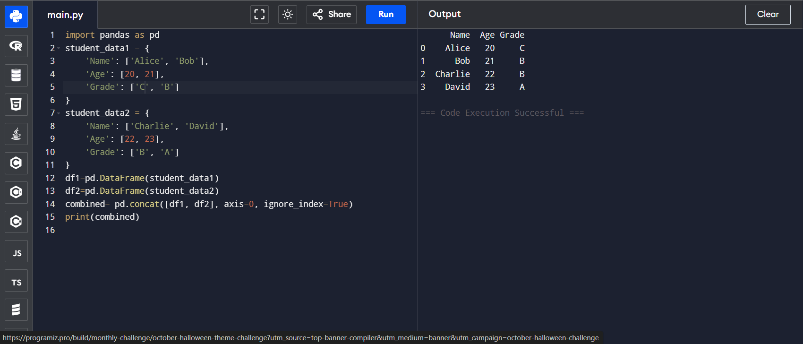

# 🧪 Pandas Program: Join Two DataFrames Along Rows

## 🎯 AIM

To write a Python program using Pandas to **join two DataFrames along rows** (row-wise concatenation) and assign all data to a new DataFrame.

---

## 🧠 ALGORITHM

1. **Import Libraries**: Import the `pandas` library.
2. **Create First DataFrame**: Use a dictionary to create `student_data1`.
3. **Create Second DataFrame**: Use another dictionary to create `student_data2`.
4. **Concatenate DataFrames**: Use `pd.concat()` with `axis=0` to concatenate both DataFrames row-wise.
5. **Display Result**: Print the new combined DataFrame.

---

## 💻 Program
```
import pandas as pd
student_data1 = {
    'Name': ['Alice', 'Bob'],
    'Age': [20, 21],
    'Grade': ['C', 'B']
}
student_data2 = {
    'Name': ['Charlie', 'David'],
    'Age': [22, 23],
    'Grade': ['B', 'A']
}
df1=pd.DataFrame(student_data1)
df2=pd.DataFrame(student_data2)
combined= pd.concat([df1, df2], axis=0, ignore_index=True)
print(combined)
```

## Output

## Result
Hence the program is executed and the output is verified