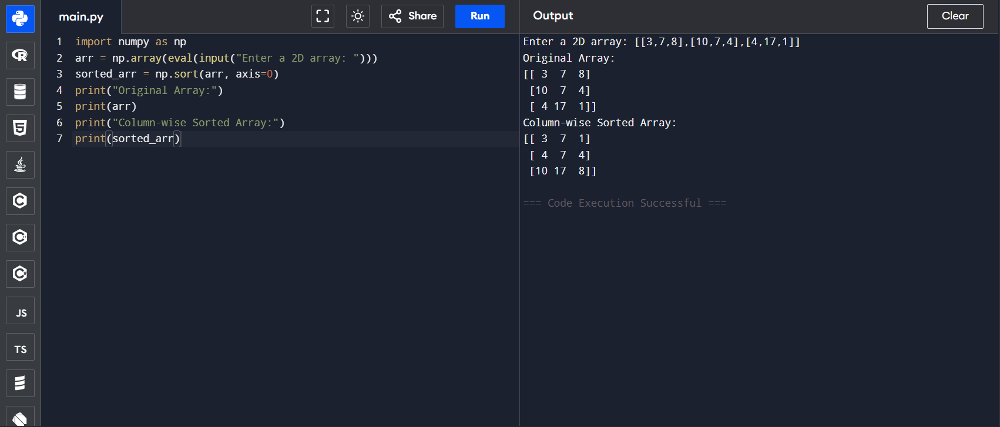
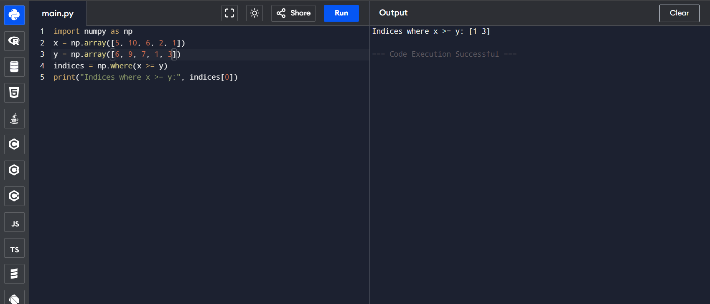
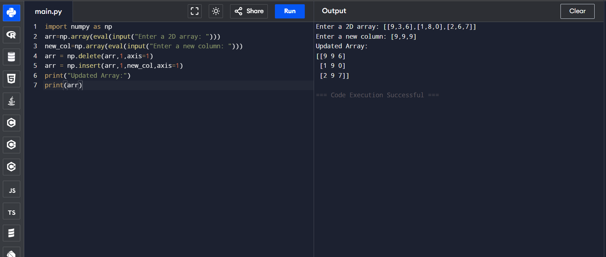
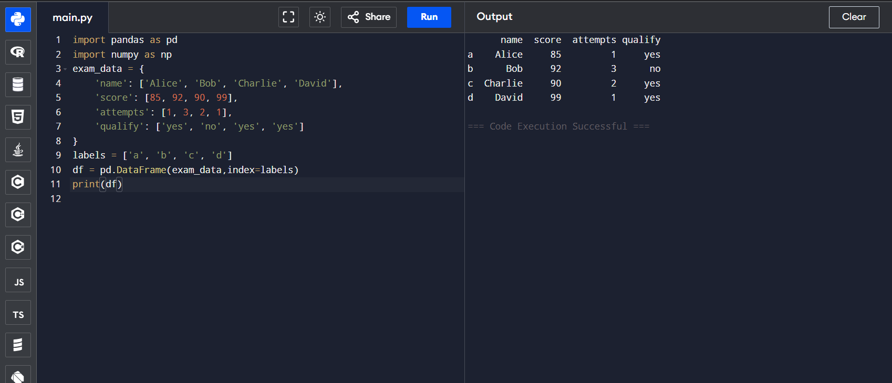
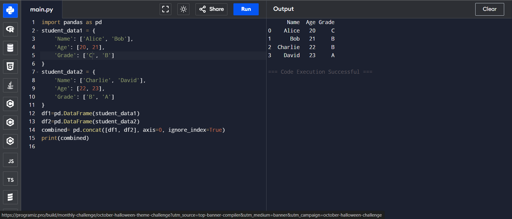

# NumPy Program: Column-wise Sorting of a 2D Array

## 🎯 Aim
To write a **NumPy** program that sorts the elements in each column of a given 2D array in ascending order.

## 🧠 Algorithm

1. **Import NumPy**: Start by importing the NumPy library.
2. **Get Input**: Accept a 2D NumPy array from the user.
3. **Sort Column-wise**: Use the `np.sort()` function with `axis=0` to sort each column in ascending order.
4. **Store Result**: Store the sorted result in a new array.
5. **Display Output**: Print the original array and the column-wise sorted array.

## 🧾 Program
```
import numpy as np
arr = np.array(eval(input("Enter a 2D array: ")))
sorted_arr = np.sort(arr, axis=0)
print("Original Array:")
print(arr)
print("Column-wise Sorted Array:")
print(sorted_arr)
```


## Output

## Result
Hence the program is executed and the output is verified

# # NumPy Program: Find Indices Where Elements in Array x are Greater Than or Equal to Corresponding Elements in Array y

## 🎯 Aim
To write a Python program using **NumPy** that finds the indices where elements in array `x` are greater than or equal to their corresponding elements in array `y`.

## 🧠 Algorithm
1. **Import NumPy**: Import the NumPy library.
2. **Define Arrays**: Define two NumPy arrays, `x` and `y`, with the same shape (i.e., same number of elements).
3. **Use Boolean Indexing**: 
   - `x > y` gives a boolean array where elements of `x` are greater than `y`.
   - `x == y` gives a boolean array where elements of `x` are equal to `y`.
4. **Find Indices**: Use `np.where()` to get the indices where the conditions `x >= y` are satisfied.
5. **Print Indices**: Print the indices where the condition holds true.

## 🧾 Program
```
import numpy as np
x = np.array([5, 10, 6, 2, 1])
y = np.array([6, 9, 7, 1, 3])
indices = np.where(x >= y)
print("Indices where x >= y:", indices[0])
```

## Output

## Result
Hence the program is executed and the output is verified

# NumPy Program: Replace the Second Column in a 2D Array

## 🎯 Aim
To write a **NumPy** program that deletes the second column from a given 2D array and inserts a new column at the same position.

## 🧠 Algorithm
1. **Import NumPy**: Start by importing the NumPy library.
2. **Get Input**: Get a 2D NumPy array and a new column (as another array) from the user.
3. **Delete Column**: Use `np.delete()` to remove the second column (index 1) from the original array.
4. **Insert Column**: Use `np.insert()` to insert the new column at the second column's original position.
5. **Display Result**: Print the updated array with the replaced column.

## 🧾 Program
```
import numpy as np
arr=np.array(eval(input("Enter a 2D array: ")))
new_col=np.array(eval(input("Enter a new column: ")))
arr = np.delete(arr,1,axis=1)
arr = np.insert(arr,1,new_col,axis=1)
print("Updated Array:")
print(arr)
```

## Output

## Result
Hence the program is executed and the output is verified

# Pandas Program: Create and Display a DataFrame with Custom Index Labels

## 🎯 Aim

To create and display a **DataFrame** using the **Pandas** library in Python from a given dictionary, and apply specific index labels to the rows.

---

## 🧠 Algorithm

1. **Import Libraries**: Import the required libraries – `pandas` and `numpy`.
2. **Create Dictionary**: Define a dictionary `exam_data` with keys: `'name'`, `'score'`, `'attempts'`, and `'qualify'`.
3. **Index Labels**: Create a list of custom index labels called `labels`.
4. **Create DataFrame**: Use `pd.DataFrame()` to create the DataFrame by passing the dictionary and index labels.
5. **Display Output**: Display the DataFrame using `print()` or by simply calling the DataFrame variable.

---

## 💻 Program
```
import pandas as pd
import numpy as np
exam_data = {
    'name': ['Alice', 'Bob', 'Charlie', 'David'],
    'score': [85, 92, 90, 99],
    'attempts': [1, 3, 2, 1],
    'qualify': ['yes', 'no', 'yes', 'yes']
}
labels = ['a', 'b', 'c', 'd']
df = pd.DataFrame(exam_data,index=labels)
print(df)
```

## Output

## Result
Hence the program is executed and the output is verified

# 🧪 Pandas Program: Join Two DataFrames Along Rows

## 🎯 AIM

To write a Python program using Pandas to **join two DataFrames along rows** (row-wise concatenation) and assign all data to a new DataFrame.

---

## 🧠 ALGORITHM

1. **Import Libraries**: Import the `pandas` library.
2. **Create First DataFrame**: Use a dictionary to create `student_data1`.
3. **Create Second DataFrame**: Use another dictionary to create `student_data2`.
4. **Concatenate DataFrames**: Use `pd.concat()` with `axis=0` to concatenate both DataFrames row-wise.
5. **Display Result**: Print the new combined DataFrame.

---

## 💻 Program
```
import pandas as pd
student_data1 = {
    'Name': ['Alice', 'Bob'],
    'Age': [20, 21],
    'Grade': ['C', 'B']
}
student_data2 = {
    'Name': ['Charlie', 'David'],
    'Age': [22, 23],
    'Grade': ['B', 'A']
}
df1=pd.DataFrame(student_data1)
df2=pd.DataFrame(student_data2)
combined= pd.concat([df1, df2], axis=0, ignore_index=True)
print(combined)
```

## Output

## Result
Hence the program is executed and the output is verified